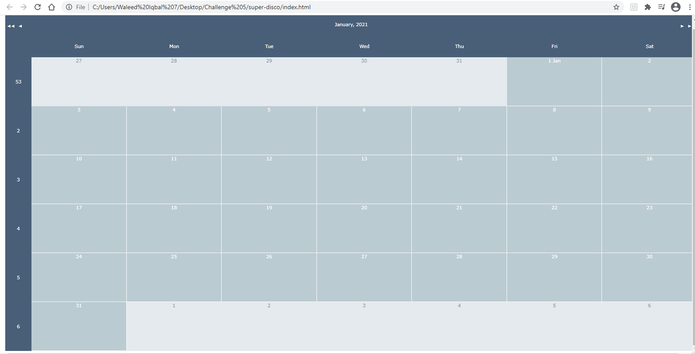

# Work Day Scheduler/Planner

Create an event on this year-round calender.
Select a date.
Pick a time slot and save your event.
The saved event will be a different color than the original theme.
The date will be shown above the daily time slot.

